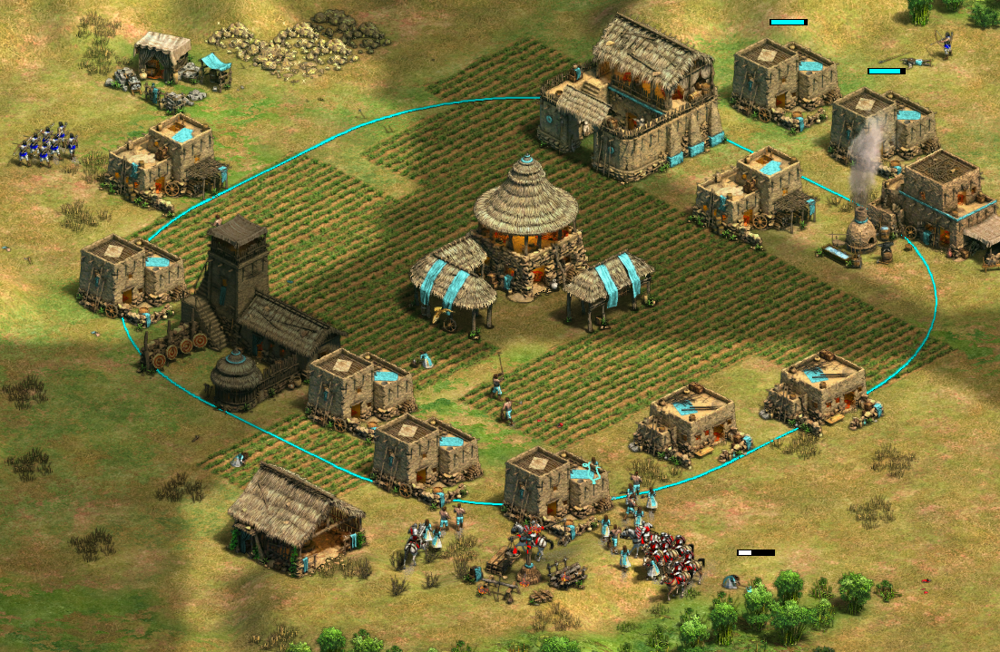

# [The Stranger — AoE2DE AI](https://www.ageofempires.com/mods/details/469929/)

An AI that aims for human-like movement and moves units in groups as much as possible.

Currently, it's in the alpha version.

## Roadmap

* [x] Typical civilizations in Arabia (both 1vs1 and 4vs4): flank civs use archers, and pocket civs use scout cavalry and cavaliers.
* [ ] Unique strategies for each civilization in Arabia. Goths, Persians (flank), and Khmer are supported.
* [ ] Walling
* [ ] Nomad
* [ ] Arena
* [ ] 10x shared civs

See details in Issues.
